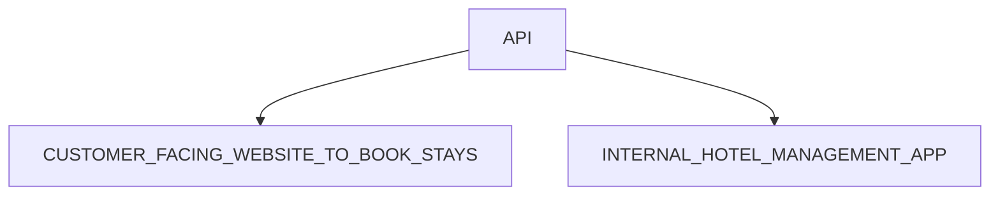

# The-Wild-Oasis

### What is The Wild Oasis?

> [!TIP]
> “The Wild Oasis” is a small boutique hotel with 8 luxurious wooden cabins  
> They need a custom-built application to manage
> everything about the hotel: bookings, cabins
> and guests  
> This is the internal application used inside the
> hotel to check in guests as they arrive
> They have nothing right now, so they also need
> the API  
> Later they will probably want a customer-facing
> website as well, where customers will be able to
> book stays, using the same API  

### API

### Project Requirments:

- [ ] Users of the app are hotel employees. They need to be logged into the application to perform tasks
- [ ] New users can only be signed up inside the applications (to guarantee that only actual hotel employees can get accounts)
- [ ] Users should be able to upload an avatar, and change their name and password
- [x] App needs a table view with all cabins, showing the cabin photo, name, capacity, price, and current discount
- [x] Users should be able to update or delete a cabin, and to create new cabins (including uploading a photo)
- [ ] App needs a table view with all bookings, showing arrival and departure dates, status, and paid amount, as well as cabin and guest data
- [ ] The booking status can be “unconfirmed” (booked but not yet checked in), “checked in”, or “checked out”. The table should be filterable
      by this important status
- [ ] Other booking data includes: number of guests, number of nights, guest observations, whether they booked breakfast, breakfast price
- [ ] Users should be able to delete, check in, or check out a booking as the guest arrives (no editing necessary for now)
- [ ] Bookings may not have been paid yet on guest arrival. Therefore, on check in, users need to accept payment (outside the app), and
      then confirm that payment has been received (inside the app)
- [ ] On check in, the guest should have the ability to add breakfast for the entire stay, if they hadn’t already
- [ ] Guest data should contain: full name, email, national ID, nationality, and a country flag for easy identification
- [ ] The initial app screen should be a dashboard, to display important information for the last 7, 30, or 90 days:
- [ ] A list of guests checking in and out on the current day. Users should be able to perform these tasks from here
- [ ] Statistics on recent bookings, sales, check ins, and occupancy rate
- [ ] A chart showing all daily hotel sales, showing both “total” sales and “extras” sales (only breakfast at the moment)
- [ ] A chart showing statistics on stay durations, as this is an important metric for the hotel
- [x] Users should be able to define a few application-wide settings: breakfast price, min and max nights/booking, max guests/booking
- [ ] App needs a dark mode

### FEATURES+PAGES

| Feature Category | Necessary pages  | URL Params          |
| ---------------- | ---------------- | ------------------- |
| Dashboard        | Dashboard        | /dashboard          |
| Bookings         | Bookings         | /bookings           |
| Check in and out | Booking check in | /checkin/:bppkingId |
| Cabins           | Cabins           | /cabins             |
| App settings     | App settings     | /settings           |
| Authentication   | User sign up     | /users              |
| Authentication   | Login            | /login              |
| Authentication   | Accaunt Settings | /accaunt            |

### Technologies and Tools:

&nbsp;
&nbsp;
&nbsp;
&nbsp;
&nbsp;
&nbsp;
&nbsp;
&nbsp;
&nbsp;
&nbsp;
&nbsp;
