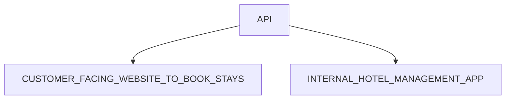

# The-Wild-Oasis (INTERNAL HOTEL MANAGEMENT APP)

### The Wild Oasis이 무었인가요?

> [!TIP]
>The Wild Oasis는 8개의 고급스러운 목조 캐빈이 있는 작은 부티크 호텔입니다. 이 프로젝트는 호텔의 내부 관리 시스템을 구축하는 것으로, 호텔 직원들이 예약, 고객, 캐빈 등을 효율적으로 관리할 수 있도록 돕는 애플리케이션입니다. 현재 이 시스템은 호텔 직원만 사용할 수 있으며, 고객용 예약 웹사이트는 추후 추가될 예정입니다.
애플리케이션은 직원들이 고객을 체크인할 때 필요한 모든 기능을 제공하며, 호텔 운영을 효율적으로 지원하기 위한 다양한 기능을 포함하고 있습니다. 여기에는 예약 관리, 객실 관리, 고객 데이터 관리, 결제 관리, 대시보드 통계 및 설정 기능 등이 포함되어 있습니다. 이 시스템은 또한 나중에 고객이 사용할 수 있는 웹사이트와 API를 연결하여, 호텔 예약과 관리를 더 원활하게 해줄 것입니다.

### API

## 주요 기능 (Key Features)
### 1.사용자 관리 (User Management)
- 호텔 직원만 사용할 수 있도록, 애플리케이션 내에서만 신규 사용자 가입 가능.
- 직원들은 프로필 사진을 업로드하고, 이름과 비밀번호를 변경할 수 있습니다.

### 2.캐빈 관리 (Cabin Management)
- 호텔의 모든 캐빈을 테이블 형식으로 표시하며, 캐빈 사진, 이름, 수용 인원, 가격, 현재 할인 정보를 확인할 수 있습니다.
- 직원들은 캐빈을 추가, 업데이트, 삭제할 수 있습니다.

### 3.예약 관리 (Booking Management)
- 예약 목록을 관리하며, 예약 상태(“확인되지 않음”, “체크인됨”, “체크아웃됨”)에 따라 필터링 가능합니다.
- 각 예약에 대한 고객 수, 숙박 일수, 조식 예약 여부 및 가격 등의 정보도 확인할 수 있습니다.
- 예약을 체크인하거나 체크아웃 처리할 수 있습니다.

### 4.결제 관리 (Payment Management)
- 체크인 시, 고객이 결제를 완료했는지 확인하고, 결제 상태를 애플리케이션 내에서 확인할 수 있습니다.
- 체크인 시, 고객이 조식을 추가할 수 있는 기능도 제공합니다.

### 5.대시보드 및 통계 (Dashboard & Analytics)
- 대시보드에서 최근 7일, 30일, 90일 동안의 중요한 통계를 한눈에 확인할 수 있습니다.
- 체크인 및 체크아웃 고객 목록, 최근 예약 및 판매 통계, 일일 판매 차트(총 판매 및 추가 판매) 등을 제공합니다.

### 6.숙박 기간 통계 (Stay Duration Statistics)
- 고객의 숙박 기간에 대한 통계를 시각적으로 제공하여, 호텔 운영에 필요한 중요한 메트릭스를 제공합니다.

### 7.애플리케이션 설정 (App Settings)
- 조식 가격, 예약 최소/최대 숙박 일수, 예약 최대 고객 수 등 애플리케이션 전반에 영향을 미치는 설정을 관리할 수 있습니다.

### 8.다크 모드 (Dark Mode)
- 다크 모드 기능을 제공하여, 사용자 경험을 향상시킵니다.

### FEATURES+PAGES

| Feature Category | Necessary pages  | URL Params          |
| ---------------- | ---------------- | ------------------- |
| Dashboard        | Dashboard        | /dashboard          |
| Bookings         | Bookings         | /bookings           |
| Check in and out | Booking check in | /checkin/:bookingId |
| Cabins           | Cabins           | /cabins             |
| App settings     | App settings     | /settings           |
| Authentication   | User sign up     | /users              |
| Authentication   | Login            | /login              |
| Authentication   | Accaunt Settings | /accaunt            |

### Technologies and Tools:

&nbsp;
&nbsp;
&nbsp;
&nbsp;
&nbsp;
&nbsp;
&nbsp;
&nbsp;
&nbsp;
&nbsp;
&nbsp;

## 얻은 성과 및 배운 점:
### 1.Supabase 라이브러리를 사용한 효율적인 백엔드 통합:
- Supabase를 사용해 실시간 데이터베이스와 인증 기능을 간편하게 구축할 수 있었고, 서버리스 환경에서 빠르게 백엔드를 구성하는 방법을 배웠습니다. 기존에 익숙했던 데이터베이스와 API 구축 방식과 달리, Supabase는 직관적이고 설정이 간단해서 빠르게 배워서 익숙할 수 있었습니다.
### 2.컴포넌트 기반 스타일링:
- Styled-components를 사용하면서 컴포넌트 단위로 스타일을 관리하는 방식에 익숙해졌습니다. 이는 코드의 재사용성을 높이고, 더 깔끔하고 유지보수가 쉬운 스타일링 방법을 배우게 해줬습니다.
- Modal Component,Compount Component과 HOC(Higher Ordered Component) 설계하면서 재사용할 수 있는 컴포넌트를 구현해 봤습니다.
- 물론, 아직 너무 깊게 배웠다고 할 수 없지만 앞으로 더 많은 프로젝트를 수행하면서 Styled-Component를 경험해 보고 싶습니다.
### 3.데이터 관리 최적화:
- React Query를 활용하여 서버에서 데이터를 가져오는 효율적인 방법을 배웠습니다. 이를 통해 서버 요청을 최적화하고, 데이터 동기화와 캐싱을 손쉽게 관리할 수 있었습니다.
### 4.폼 관리의 효율성:
- React Hook Form을 사용하여 폼의 상태 관리를 최적화하고,Form revalidation 및 error handling 등 성능을 크게 개선할 수 있었습니다. 복잡한 폼을 다룰 때 더 간단하고 직관적인 방식으로 처리할 수 있다는 것을 배웠습니다.
### 5.날짜 계산 및 관리:
- date-fns를 사용하여 날짜 관련 문제를 손쉽게 해결할 수 있었습니다. 특히 예약 시스템에서 날짜 계산을 할 때 매우 유용했으며, 다양한 날짜 형식을 처리하는 데 큰 도움이 되었습니다.
### 6.API 데이터 관리 및 처리
- Client 및 API side data filtering,sorting, pagination까지 경험해 봤습니다.이는 백언드 데이터 관리를 위한 중요한 patterns인지 깨달았습니다.
### 7.Rechart 사용 경험
- Rechart 라는 차트 라이브러리를 통해 다양한 데이터를 더 예쁘고 잘 이해할 수 있도록 UI 설계하는 것을 경험해 봤습니다. 사질은 차트 라이브러리도 재미있었고 여러 Tempo 데이터를 사용하여 재미로 다양한 차트들도 구현해 봤습니다.

